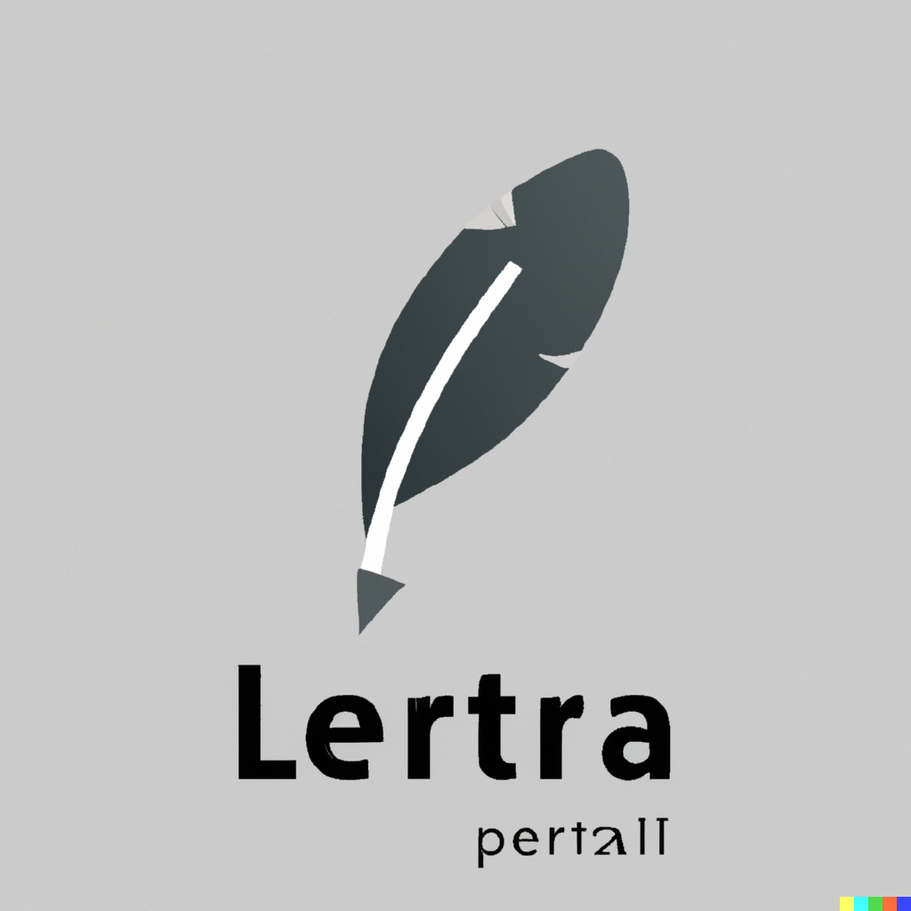
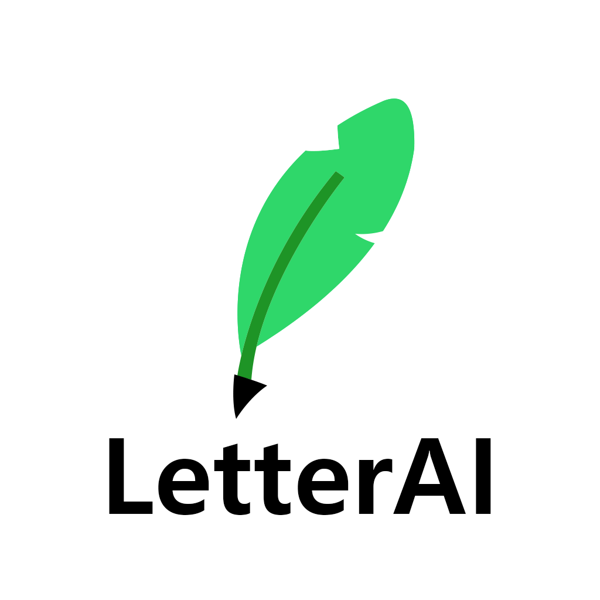

# LetterAI: 인공지능을 사용한 혁신적인 편지 작성 도우미
LetterAI는 인제대학교 컴퓨터공학과의 학생들이 Flask를 활용하여 만든 AI기반의 프로젝트입니다. 이 프로젝트는 단순한 학부 프로젝트를 넘어 AI의 강력함을 활용한 새로운 접근을 제공합니다.

## 🎨 로고
프로젝트의 로고는 DALL·E 2, 고도의 AI 기술을 사용하여 구상하고 생성하였습니다. 이로써 머신러닝이 예술과 디자인에 미칠 수 있는 영향을 보여주는 아름다운 사례가 되었습니다.
<br>
<br>

&nbsp;&nbsp;&nbsp;&nbsp;&nbsp;→&nbsp;&nbsp;&nbsp;&nbsp;&nbsp;

<br>

## 🚀 시작하기
LetterAI의 사용법은 아주 간단합니다. 다음의 명령어를 이용하여 프로젝트를 시작하세요.

1. 프로젝트를 복제 또는 다운로드합니다.<br><br>
2. Terminal에서 다음 명령어를 실행합니다.
```Powershell
C:/{your_path}/LetterAI/LetterAI> Scripts/activate
```
3. 이후 웹 브라우저를 열어 로컬 호스트의 5000번 포트를 접속합니다. 예시로 아래와 같은 주소를 사용할 수 있습니다.<br>
http://127.0.0.1:5000/

## 💰 비용
LetterAI는 웹 인터페이스를 통해 OpenAI API를 더 쉽게 사용할 수 있도록 만든 도구입니다. 그러나 OpenAI API에 대한 비용은 별도로 청구되므로 사용자는 개인의 API 키를 입력해야 합니다.